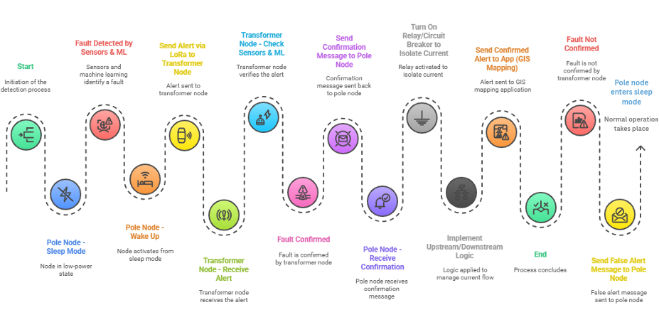
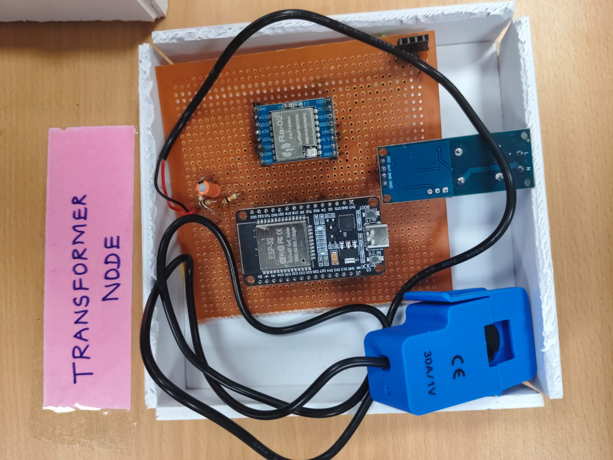
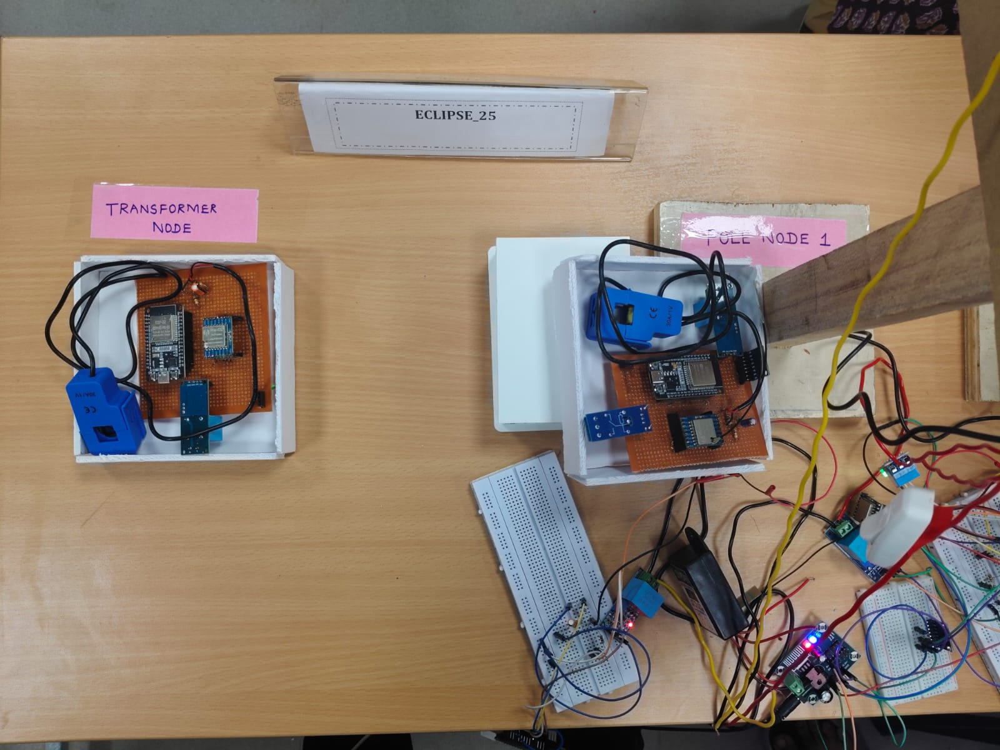

# Detection of Leakage in Low AC Voltage Overhead Conductors

## Overview

A LoRa-enabled smart monitoring system designed to detect leakage faults in low AC voltage overhead conductors. The system continuously monitors voltage, current, and pole inclination to identify abnormal conditions, isolate faulty sections using a relay, and transmit real-time alerts to a monitoring dashboard, improving electrical safety and reducing maintenance response time.

## Problem Statement

Low AC voltage overhead conductors are vulnerable to leakage faults, damaged poles, and abnormal operating conditions, which can lead to electrical hazards, equipment damage, and power interruptions. Conventional inspection methods are manual, time-consuming, and often delay fault detection. This project provides an automated, real-time monitoring solution for early fault detection and rapid maintenance response.

## Key Features

- Real-time voltage monitoring using ZMPT101B sensor
- Current monitoring using SCT-013 current sensor
- Leakage fault detection
- Pole tilt monitoring using MPU6050
- Automatic relay-based isolation of faulty lines
- LoRa-based long-range wireless communication
- Real-time fault alerts on the monitoring dashboard
- Continuous monitoring with low-power operation

## Technologies Used

### Hardware
- ESP32
- LoRa Module
- ZMPT101B Voltage Sensor
- SCT-013 Current Sensor
- MPU6050 Accelerometer & Gyroscope
- Relay Module
- AC Power Supply

### Software
- Arduino IDE
- Node.js
- HTML
- CSS
- JavaScript

## System Workflow

The system continuously measures the conductor voltage using the ZMPT101B voltage sensor, current using the SCT-013 current sensor, and pole inclination using the MPU6050 sensor. The ESP32 processes the sensor data to detect leakage faults or abnormal pole tilt. When an abnormal condition is identified, the relay isolates the affected power line while the LoRa module transmits fault information to the monitoring dashboard for immediate maintenance action.

## Prototype

### Prototype - Hardware Setup

The prototype integrates an ESP32 controller with LoRa communication, ZMPT101B voltage sensing, SCT-013 current sensing, MPU6050 tilt monitoring, and relay-based fault isolation to continuously monitor overhead conductors.

### Prototype

The developed prototype successfully detects leakage faults, monitors pole tilt, isolates faulty sections through relay control, and sends real-time fault notifications to the monitoring dashboard using LoRa communication.

## Results

- Successfully monitored voltage, current, and pole inclination in real time.
- Detected leakage faults using voltage and current analysis.
- Identified abnormal pole tilt using the MPU6050 sensor.
- Automatically isolated faulty sections through relay control.
- Transmitted real-time alerts to the monitoring dashboard using LoRa communication.
- Improved electrical safety and reduced maintenance response time.

## Future Scope

- GPS-based fault location tracking
- Cloud-based monitoring and analytics
- Mobile application for utility personnel
- AI-based predictive fault analysis
- Integration with smart grid infrastructure
